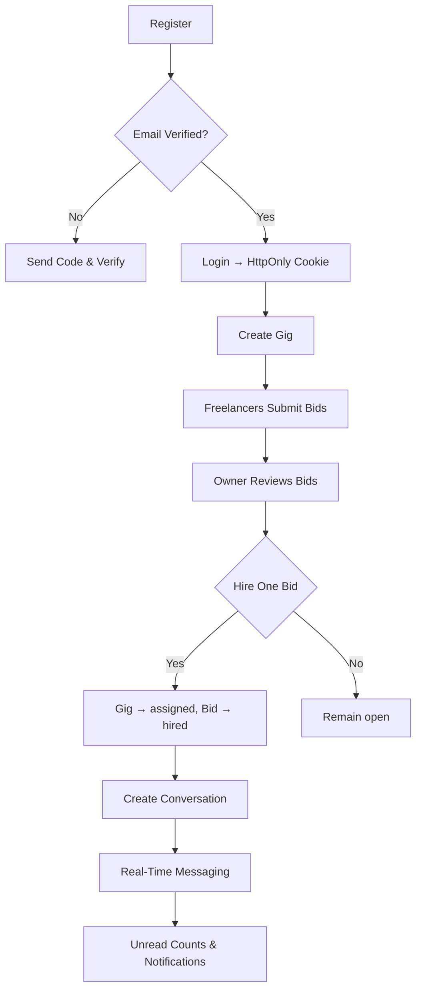
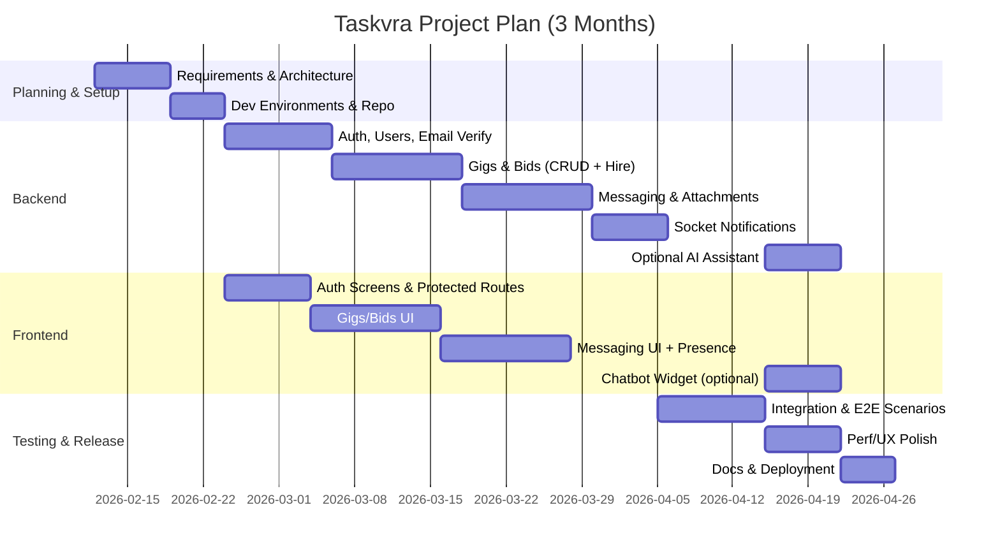
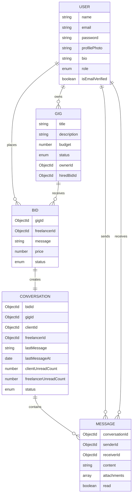

# Taskvra — Project Presentation (MERN Freelance Marketplace)

This deck provides structured content for a 12‑section project PPT. You can copy each section into PowerPoint/Google Slides, and use the Mermaid diagram blocks with any Mermaid renderer to export images for slides.

---

## 1. Project Title
Taskvra — Secure MERN Freelance Marketplace with Real‑Time Messaging and AI Assistant

---

## 2. Introduction & Objectives
- Build a safe, modern marketplace where clients post gigs and freelancers submit bids.
- Ensure single‑hire per gig with atomic status updates and uniqueness.
- Provide verified, cookie‑based authentication and profile management.
- Enable real‑time conversations, message notifications, and file attachments.
- Offer optional AI assistant to help compose gig descriptions and bids.
- Deliver a responsive, intuitive UI with protected routes and role‑aware views.

---

## 3. SRS (System Requirement Specification)
### Functional Requirements
- User Management: Register, email verification, login/logout, edit profile photo/name.
- Gig Management: Create, list, search gigs; view gig details; owner lists own gigs.
- Bidding: Freelancers submit bid with price and message; unique (gig, freelancer).
- Hiring: Owners hire one bid per gig; hired bid becomes conversation; notify freelancer.
- Messaging: Real‑time chat in hired conversations, attachments via Cloudinary, unread counts.
- Notifications: Socket.io events for online presence, new messages, hiring.
- AI Assistant: Optional `/api/ai/chat` to draft content (requires Groq API key).

### Non‑Functional Requirements
- Security: HttpOnly cookies, CORS with credentials, input validation.
- Performance: Indexed queries on users, gigs, bids, conversations, messages.
- Reliability: Clear error handling, schema validation, defensive checks on status transitions.
- Scalability: Socket.io rooms, stateless REST API, cloud‑ready media storage.
- Usability: Responsive, accessible components, meaningful toasts, straightforward flows.

### Environment & Config (dev)
- Backend: Node.js/Express, MongoDB, Socket.io, Cloudinary, Nodemailer.
- Frontend: Vite + React 18, Redux Toolkit, Axios, Socket.io client.
- `.env` keys summarized in Technical Documentation.

---

## 4. Process Logic
### Core Flowchart (high level)


---

## 5. Gantt Chart (3 Months)


---

## 6. Data Dictionary (Key Entities)
### User
- Fields: `name:String`, `email:String unique`, `password:String (hashed, select:false)`, `profilePhoto:String?`, `bio:String?`, `role:enum(client|freelancer|both)`, `isEmailVerified:Boolean`, `emailVerificationCode:String?`, `emailVerificationExpires:Date?`, `timestamps`.

### Gig
- Fields: `title:String`, `description:String`, `budget:Number`, `status:enum(open|assigned)`, `ownerId:ObjectId(User)`, `hiredBidId:ObjectId(Bid)?`, `timestamps`.

### Bid
- Fields: `gigId:ObjectId(Gig)`, `freelancerId:ObjectId(User)`, `message:String`, `price:Number`, `status:enum(pending|hired|rejected)`, `timestamps`.
- Constraint: Unique composite index `(gigId, freelancerId)`.

### Conversation
- Fields: `bidId:ObjectId(Bid) unique`, `gigId:ObjectId(Gig)`, `clientId:ObjectId(User)`, `freelancerId:ObjectId(User)`, `lastMessage:String?`, `lastMessageAt:Date?`, `clientUnreadCount:Number`, `freelancerUnreadCount:Number`, `status:enum(active|closed)`, `timestamps`.

### Message
- Fields: `conversationId:ObjectId(Conversation)`, `senderId:ObjectId(User)`, `receiverId:ObjectId(User)`, `content:String?`, `attachments:[{fileName, fileSize, fileType, fileUrl, uploadedAt}]`, `read:Boolean`, `timestamps`.
- Rule: Must have `content` or at least one `attachment`.

---

## 7. Data Flow Diagram (DFD)
```mermaid
flowchart LR
  subgraph Client
    U[User]
  end
  subgraph Frontend (React)
    FE[UI + Redux + Axios + Socket]
  end
  subgraph Backend (Express)
    API[REST Controllers]
    AUTH[JWT/Auth]
    MSG[Messaging]
    BID[Gig/Bid]
  end
  DB[(MongoDB)]
  CDN[(Cloudinary)]
  SMTP[(Email)]

  U --> FE
  FE -->|HTTP| API
  API --> AUTH
  API --> BID
  API --> MSG
  BID --> DB
  AUTH --> DB
  MSG --> DB
  MSG --> CDN
  API -->|SMTP| SMTP
  FE <-->|Socket.io| Backend
```

---

## 8. ER Diagram


---

## 9. Interface (Screens & Components)
- Auth: Login, Register, Email verify flow, Profile edit modal.
- Gigs: Landing, Find Work, Find Freelance, Gig list/card, Create gig.
- Bids: Bid form, Bid list, My Bids.
- Messaging: Conversation list, Chat window, Messages page.
- Layout: Navbar, Footer, ProtectedRoute.
- Extras: ChatBotWidget, NotificationToast.

---

## 10. Expected Report Generation
- My Gigs Report: Gig title, budget, status, createdAt.
- My Bids Report: Gig, price, status (pending/hired/rejected), createdAt.
- Hiring Summary: Hired bids per gig, timestamps, freelancer details.
- Conversation Activity: Messages per conversation, unread counts, lastMessageAt.
- Attachment Audit: Files sent per conversation with types and sizes.

(Reports can be exported via simple CSV endpoints or generated in UI tables with filters.)

---

## 11. References / Bibliography
- Express: https://expressjs.com/
- MongoDB + Mongoose: https://mongoosejs.com/
- Socket.io: https://socket.io/
- Cloudinary: https://cloudinary.com/documentation
- Nodemailer: https://nodemailer.com/about/
- React + Redux Toolkit: https://react.dev/ and https://redux-toolkit.js.org/
- Axios: https://axios-http.com/
- Vite: https://vitejs.dev/
- Groq SDK (optional): https://groq.com/

---

## 12. Future Scope
- Payments & Escrow: Integrate Stripe/PayPal, milestone payments, dispute resolution.
- Ratings & Reviews: Post‑hire feedback, reputation scores for users.
- Advanced Search & Tags: Skill tags, fuzzy search, ranking.
- Admin Dashboard: User moderation, gig auditing, platform analytics.
- Mobile App: React Native client with push notifications.
- Internationalization: Localization and multi‑currency support.
- Compliance: GDPR features (data export/delete), audit trails.
- Scalability: Queue/stream processing for email/notifications, sharded data.
